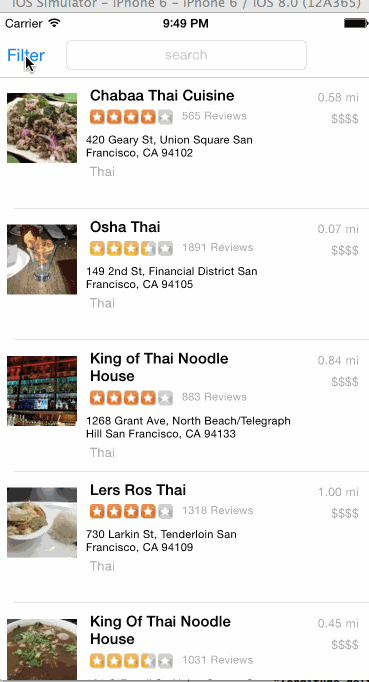

YelpClassProject
================
## Synopsis

This is the code for the Week 2 Project: Yelp

## Number of hours spent

I spent about 14 hours implementing all the required features ( a lot of the time was spent getting auto layout correct. 
If I have one more day I would have really cleaned up the code and made it much more DRY and modular)

## Features Implemented(required)

* Table rows should be dynamic height according to the content height
* Custom cells should have the proper Auto Layout constraints
* Search bar should be in the navigation bar (doesn't have to expand to show location like the real Yelp app does).
* The filters you should actually have are: category, sort (best match, distance, highest rated), radius (meters), deals (on/off).
* The filters table should be organized into sections as in the mock.
* You can use the default UISwitch for on/off states. Optional: implement a custom switch
* Radius filter should expand as in the real Yelp app
* Categories should show a subset of the full list with a "See All" row to expand. Category list is here: http://www.yelp.com/developers/documentation/category_list (Links to an external site.)
* Clicking on the "Search" button should dismiss the filters page and trigger the search w/ the new filter settings.

## Known issues
* hardcoded the latitude and longitude (couldn't get the location finding to work on simulator)
* deals_filter is not working correctly. If I had more time I would fool around more with it but for now just leave it
* the two controllers are too bloated. As discussed in previous class, it is good to put a lot of logic for getting the restaurants and parsing the info into a Restaurant class. Would definitely do that in the assignment

## Installation
The pods directory was also checked in so theoretically should just need to load FinalYelpApp.xcworkspace

## Third party libraries used

* AFNetworking (for asynchronous loading of images)
* RNActivityView (for showing the loading dialog)
* BDBOAuth1Manager

## Animated gif walkthrough

GIF created with [LiceCap](http://www.cockos.com/licecap/).
